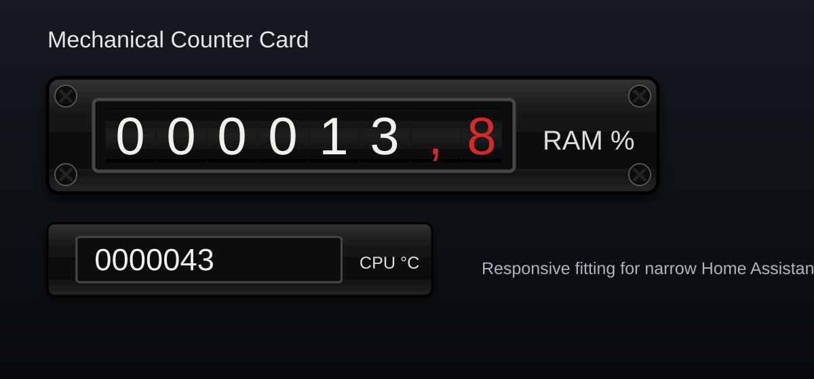

# Mechanical Counter Card

[](https://github.com/loungelizard2018/mechanical-counter-card/actions/workflows/validate.yml)
[](https://my.home-assistant.io/redirect/hacs_repository/?owner=loungelizard2018&repository=mechanical-counter-card&category=plugin)

A photorealistic mechanical odometer-style counter card for Home Assistant.
It uses the same black textured housing and black cross-head screws as the matching analog gauge card.



## Features

- Mechanical digits roll upward when the value changes.
- Separately configurable integer and decimal colours.
- One register or multiple registers, for example HT/NT energy meters.
- Original embedded gauge housing texture and screw assets; no external image files are required at runtime.
- Automatic responsive fitting: the complete component scales down to the actual Home Assistant column width.
- Works in Masonry, Sections, Grid and narrow mobile layouts without extending into the neighbouring column.
- Supports entity states and numeric entity attributes.
- No external JavaScript dependencies.

## Installation with HACS

1. Open HACS.
2. Open the three-dot menu and select **Custom repositories**.
3. Add `https://github.com/loungelizard2018/mechanical-counter-card`.
4. Select **Dashboard** as the category.
5. Install **Mechanical Counter Card**.
6. Reload the Home Assistant frontend.

The HACS resource path is:

```text
/hacsfiles/mechanical-counter-card/mechanical-counter-card.js
```

## Manual installation

Copy `mechanical-counter-card.js` to:

```text
/config/www/mechanical-counter-card/mechanical-counter-card.js
```

Register it as a JavaScript module:

```text
/local/mechanical-counter-card/mechanical-counter-card.js
```

## Basic configuration

```yaml
type: custom:mechanical-counter-card
entity: sensor.ram_usage
integer_digits: 6
decimals: 1
label: RAM
unit: "%"

# Default: automatically shrink the complete card to the available column width.
fit_to_card: true

frame: gauge_black
screws: true
integer_color: "#f3f3ed"
decimal_color: "#d52b2b"
meta_color: "#dedede"
```

## Multiple registers

```yaml
type: custom:mechanical-counter-card
fit_to_card: true
allow_upscale: false
transparent_card: true
frame: gauge_black
screws: true
screw_size: 28
integer_color: "#f3f3ed"
decimal_color: "#d52b2b"
meta_color: "#dedede"
animation: true
animation_duration: 720
animation_stagger: 45

registers:
  - entity: sensor.stromzaehler_ht
    label: HT
    unit: kWh
    integer_digits: 6
    decimals: 1

  - entity: sensor.stromzaehler_nt
    label: NT
    unit: kWh
    integer_digits: 7
    decimals: 0
```

## Responsive fitting

Responsive fitting is enabled by default:

```yaml
fit_to_card: true
allow_upscale: false
```

The card measures its actual dashboard column with `ResizeObserver`. If the natural counter width is larger than the available width, the complete assembly is scaled proportionally, including:

- housing and texture
- all four screws
- counter window and drums
- label and unit
- shadows and glass effects

The calculated height is updated as well, so the next card is positioned correctly and no horizontal scrollbar is introduced.

To keep the configured physical size even when it does not fit:

```yaml
fit_to_card: false
```

Optional enlargement in wide columns:

```yaml
fit_to_card: true
allow_upscale: true
max_fit_scale: 1.25
```

## Main options

| Option | Default | Description |
|---|---:|---|
| `entity` | required | Numeric Home Assistant entity |
| `attribute` | unset | Numeric attribute instead of entity state |
| `integer_digits` | `6` | Number of integer drums |
| `decimals` | `0` | Number of decimal drums |
| `decimal_separator` | `,` | Decimal separator displayed between drums |
| `integer_color` | `#f2f2ec` | Integer digit colour |
| `decimal_color` | `#d52b2b` | Decimal digit and separator colour |
| `meta_color` | `#dedede` | Default label and unit colour |
| `label_color` | `meta_color` | Separate label colour |
| `unit_color` | `meta_color` | Separate unit colour |
| `fit_to_card` | `true` | Scale down to the available column width |
| `allow_upscale` | `false` | Also enlarge in wider columns |
| `max_fit_scale` | `1` | Maximum automatic enlargement |
| `scale` | `1` | Manual base scale before responsive fitting |
| `screws` | `true` | Show the gauge-style screws |
| `animation` | `true` | Enable upward rolling digits |

## Updating

Releases are published as GitHub releases. HACS will detect and install new versions through its normal update mechanism.

## Licence

MIT
